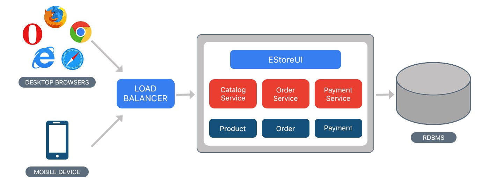
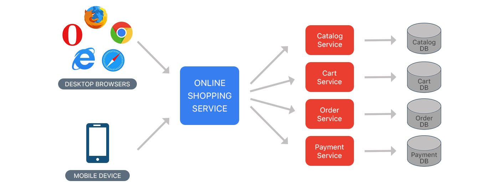

<!-- _class: lead -->
# Mikroserwisy

---
<!-- _class: lead -->
## Architektura monolityczna
 

- Jedna aplikacja
- Wspólne zależności
- Jedno wersjonowanie dla całości aplikacji
- Skalowalność tylko i wyłącznie na poziomie całej aplikacji

---

---
<!-- _class: lead -->
## Architektura mikroserwisowa
 

- Wiele niezależnych mikroserwisów, z których każdy zapewnia jedną funkcjonalność
- Niezależny development oraz skalowanie poszczególnych mikroserwisów
- Zależności na poziomie mikroserwisu
- Niezależne wersjonowanie poszczególnych mikroserwisów
- Możliwość niezależnego testowania komponentów (w granicach rozsądku)

---
<!-- _class: lead -->

---
<!-- _class: lead -->
# Docker i konteneryzacja

---
<!-- _class: lead -->

---
<!-- _class: lead -->
## Zalety kontenerów

- Dynamiczna alokacja zasobów
- Możliwość wykorzystywania hardware'u za pośrednictwem sterowników systemu hosta
- Niewielki overhead, pozwalający na tworzenie bardzo zminiaturyzowanych serwisów
- Łatwość w budowie i automatyzacji

---
<!-- _class: lead -->
## Docker

- Implementacja technologii kontenerowej przystosowana do masowego zastosowania
- Posiada własną sieć typu overlay
- Wsparcie dla zewnętrznych repozytoriów obrazów
- Duża ilość dostępnych gotowych obrazów kontenerów

---
<!-- _class: lead -->

---
<!-- _class: lead -->
## Dziękuję za uwagę
 
