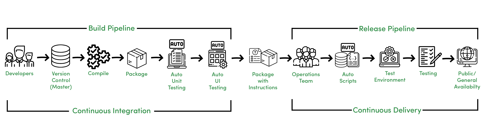

<!-- _class: lead -->
# Continuous Integration/Continuous Delivery

---
<!-- _class: lead -->
## CI
 

- Automatyzacja procesu budowania
- Automatyzacja testów
- Wykonywane przy każym commicie do mainline

---
<!-- _class: lead -->
## Narzędzia CI
 

- Github Actions
- Gitlab CI
- Google Cloud Build
- Azure Pipelines
- AWS CodePipeline
- Jenkins

---
<!-- _class: lead -->
## CD
 

- Automatyzacja wdrożenia nowej wersji oprogramowania na produkcji
- Może być poprzedzona testami manualnymi
- Może wymagać dodatkowej autoryzacji wdrożenia nowej wersji

---
<!-- _class: lead -->
## Narzędzia CD
 

- ArgoCD
- FluxCD
- Jenkins
- GoCD
- Azure DevOps
  
---
<!-- _class: lead -->

